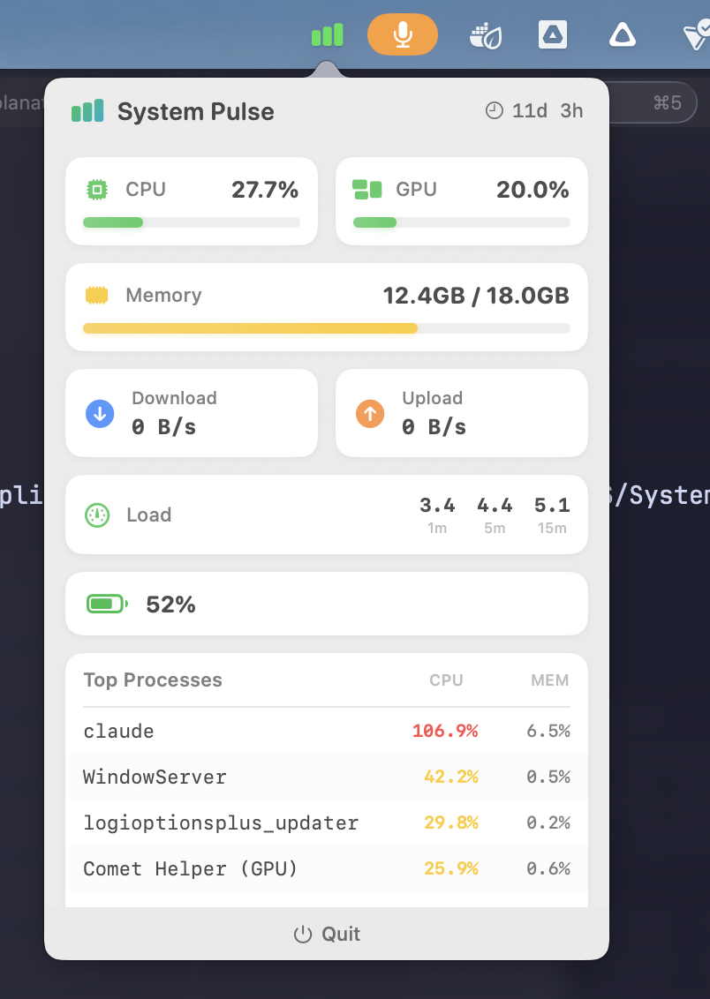

# System Pulse

A lightweight, native macOS menubar app for real-time system monitoring.



## Features

- **CPU Usage** - Real-time processor utilization with color-coded status
- **GPU Usage** - Graphics processor monitoring via IOKit
- **Memory** - Used/Total RAM with visual progress bar
- **Network I/O** - Download and upload throughput
- **Load Average** - 1m, 5m, 15m system load indicators
- **Battery** - Charge level and charging status (MacBooks)
- **Top Processes** - Live view of highest CPU consumers

## Installation

### Homebrew (Recommended)

```bash
brew install --cask systempulse
```

### Manual Installation

1. Download the latest release from [Releases](https://github.com/jackfelke/SystemPulse/releases)
2. Move `SystemPulse.app` to `/Applications`
3. Launch from Applications or Spotlight

### Build from Source

Requires macOS 13+ and Swift 5.9+

```bash
git clone https://github.com/jackfelke/SystemPulse.git
cd SystemPulse
swift build -c release
cp .build/release/SystemPulse /Applications/SystemPulse.app/Contents/MacOS/
```

## Requirements

- macOS 13.0 (Ventura) or later
- Apple Silicon or Intel Mac

## Privacy

System Pulse runs entirely locally. No data is collected or transmitted. The app requires no special permissions beyond standard system monitoring APIs.

## Tech Stack

- **SwiftUI** - Native macOS UI framework
- **IOKit** - Hardware monitoring (GPU, Battery)
- **Mach APIs** - CPU and memory statistics
- **AppKit** - Menubar integration

## Contributing

Contributions welcome! Please open an issue or submit a PR.

## License

MIT License - see [LICENSE](LICENSE) for details.

## Author

Jack Felke ([@jackfelke](https://github.com/jackfelke))
